# Deployed a Python Application Using Jenkins CICD Declarative Pipeline

This project demonstrates a practical implementation of a CI/CD pipeline using Jenkins Declarative syntax to automate the deployment of a Python application.

The goal is to streamline the development workflow by integrating automated stages for building, testing, and deploying the application. The pipeline is defined in a Jenkinsfile using the Declarative Pipeline model, which provides a structured and readable way to define multi-stage delivery processes.

## Key Features

- **Source Control Integration:** Automatically pulls source code from a remote Git repository.

- **Environment Setup:** Creates a Python virtual environment and installs dependencies using `requirements.txt.`

- **Automated Testing:** Runs unit tests with pytest to validate application logic.

- **Build Stage:** (Optional) Includes hooks for Docker image creation or packaging artifacts.

- **Deployment Stage:** Deploys the application to a target environment (e.g., local server).

## Project Objectives

- Automate the deployment of a Python Flask application using Jenkins

- Implement a structured CI/CD pipeline with declarative Jenkins syntax

- Enable auto-testing and code validation using pytest

- Deploy the application to a cloud server (AWS EC2) via SSH

- Serve as a DevOps learning example for small to mid-scale web apps

## Step → 1 : Configure AWS with `Root User` Credentials

login to the Amazon Web Services Console using your credentials.


## Step → 2 : Create Two AWS EC2 Instances

In the AWS Management Console search bar, enter EC2, and click the EC2 result under Services:

1. **Jenkins Server Setup :**

- Click on Instances → Create instance

- Choose :
  - ***AMI*** → Ubuntu
  - ***Instane type*** → Select t2.micro (free tier)
  - ***Key pair*** → Create or use existing one
  - ***Security Group*** → Allow HTTP (port 80),
    SSH (port 22) And Jenkins (port 8080)

- Launch Insatnce

- **Python server Setup :**

- Click on Instances → Create instance

- Choose:

  - ***AMI*** → Ubuntu
  - ***Instane type*** → Select t2.micro (free tier)
  - ***Key pair*** → Create or use existing one
  - ***Security Group*** → Allow HTTP (port 80), SSH (port 22) And Python (port 5000)

- Launch Insatnce

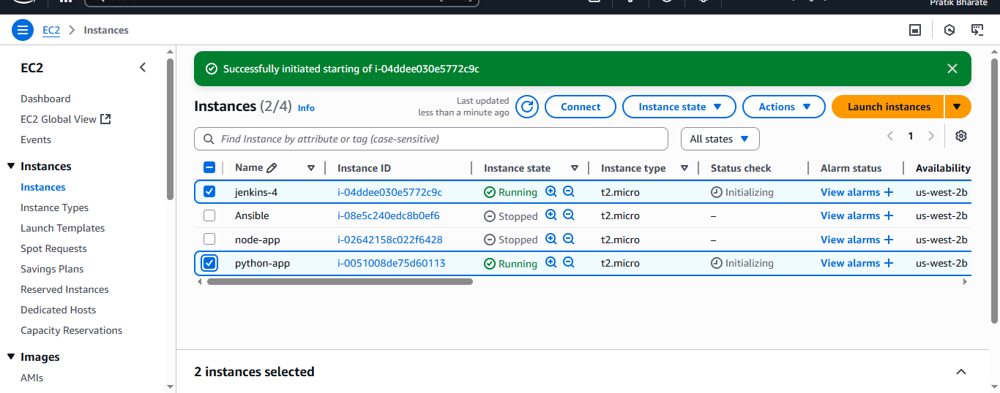

## Step → 3 : Connect Instance using SSH

```sh
ssh -i <private-key> ubuntu@<public-IP>
```

## Step → 4 : Install Jenkins on Jenkins Server

- Jenkins is built on Java so, to install Jenkins we first need to install Java on the ubuntu server

- Run the below command on the jenkins

```sh
sudo apt update
sudo apt install openjdk-17-jdk -y
java --version
```

- Now, Run the below commands on the Jenkins for jenkins Installation

```sh
sudo wget -O /etc/apt/keyrings/jenkins-keyring.asc \
https://pkg.jenkins.io/debian-stable/jenkins.io-2023.key
echo "deb [signed-by=/etc/apt/keyrings/jenkins-keyring.asc]" \
https://pkg.jenkins.io/debian-stable binary/ | sudo tee \
/etc/apt/sources.list.d/jenkins.list > /dev/null
sudo apt-get update
sudo apt-get install jenkins
```

- Now, Start and Enable Jenkins

```sh
sudo systemctl Start Jenkins
sudo systemctl enable Jenkins
```

## Project Directory Structure

```sh
pythonapp/
├── Dockerfile
├── app.log
├── app.py
├── requirements.txt
├── test/
│   └── test.py
└── venv/  (virtual environment)
```

## Step → 5 : Copy Private Key on Jenkins Server

>[!IMPORTANT]
>
>```sh
>scp -i jenkins-key.pem jenkins-key.pem >ubuntu@<Jenkins-server-public-IP>:/home/ubuntu
>```

## Step → 6 : Install Plugins

Go to Jenkins Dashboard → Settings → Plugins → Install Plugin

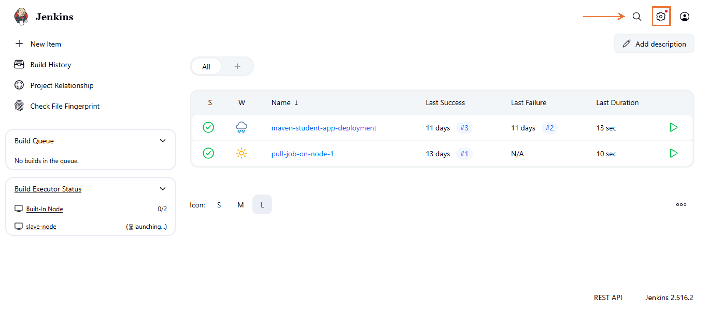

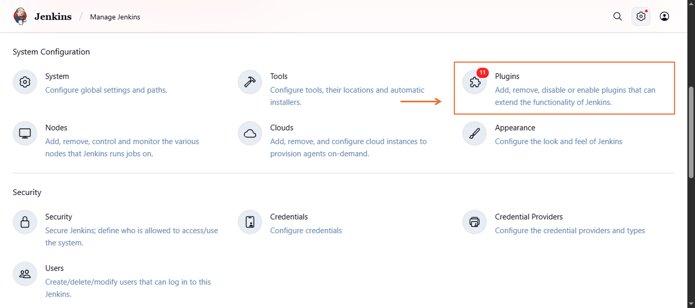

- Ssh-agent

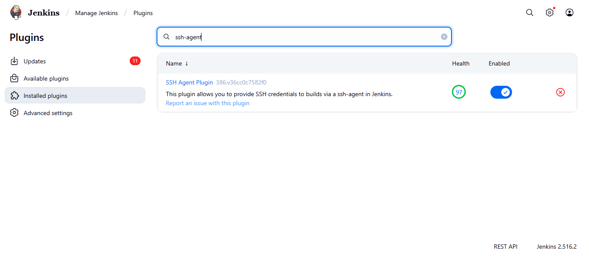

- Github

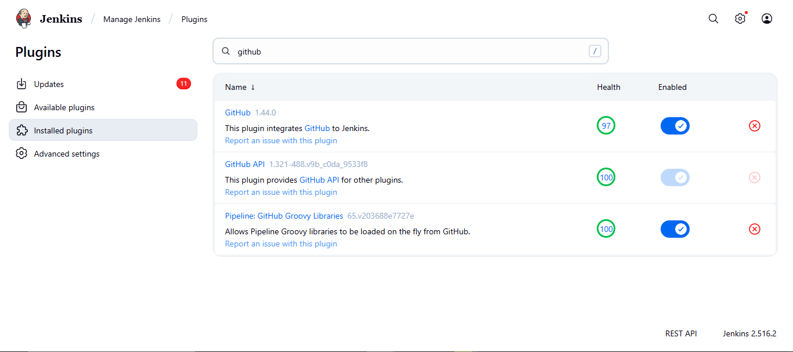

## Step → 7 : Sign in Into Jenkins Server and Create New Credentials

Go to Manage Jenkins → Credentials

Add a new SSH Username with private key

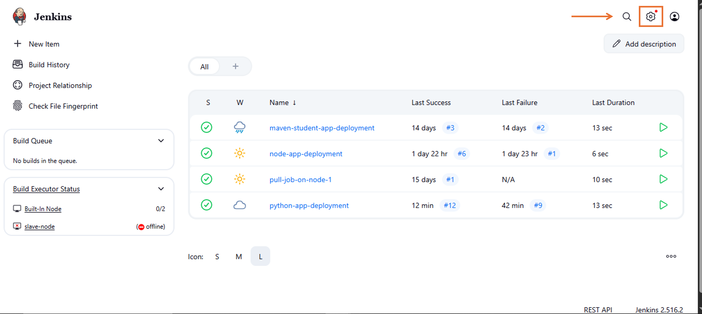

Click → Global

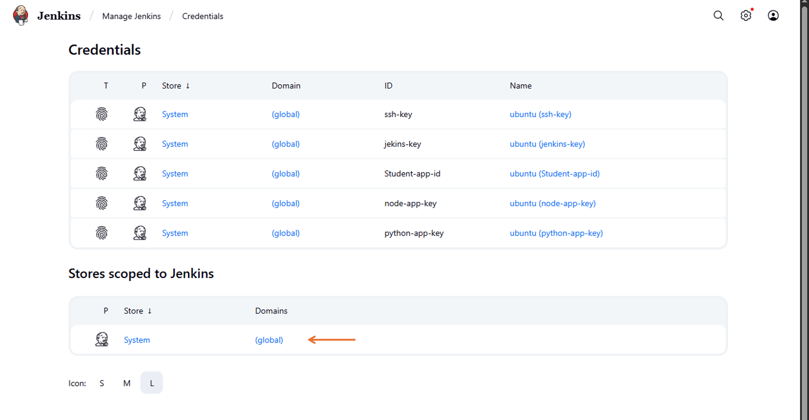

Global Credentials → add Credentials

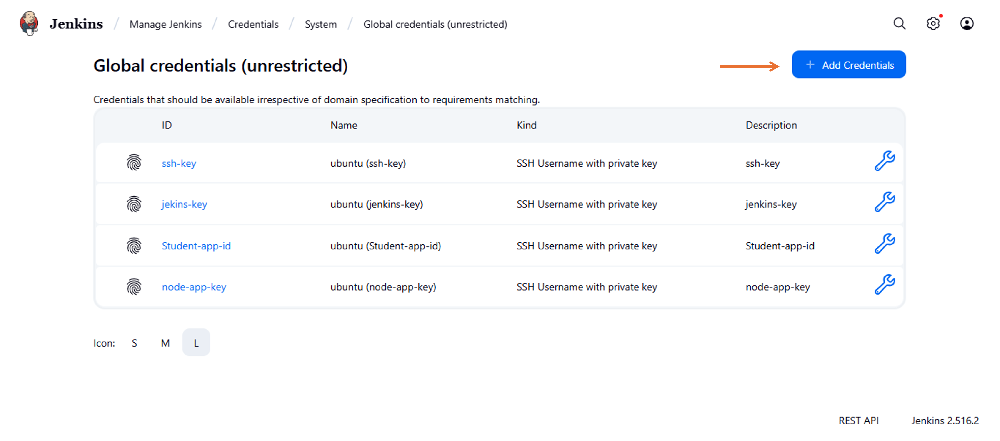

Choose: Kind → SSH Username with private key

ID → node-app-key

Username → ubuntu

Private Key → Enter your private key directly or upload it

Click → Create

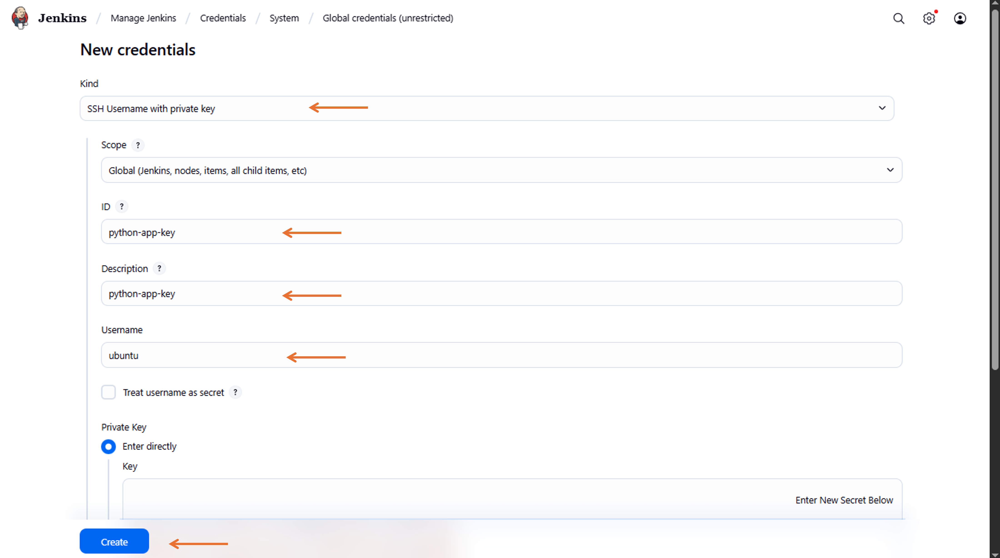

## Step → 8 : Create a New Job

Click → New Item

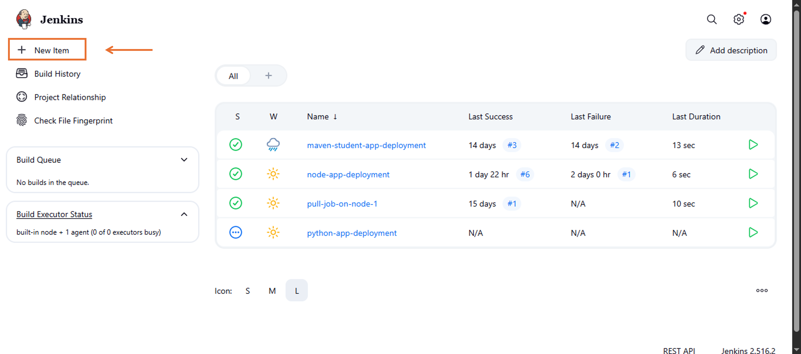

Enter a Job Name → Python-app-deployment

Select → Pipeline (recommended for full CI/CD)

Click → OK

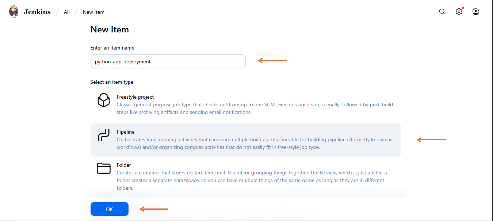

Check → Github hook trigger

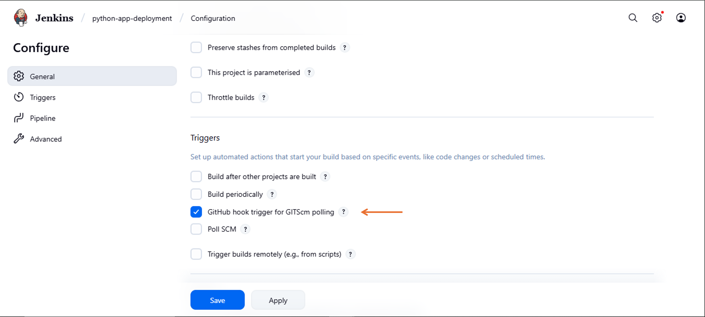

Select :

Source Code Management

Choose → Git

Enter your GitHub repo URL (e.g., https://github.com/yourname/python-app.git)

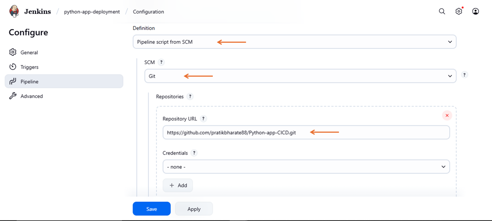

Select → Branch → Master

Script Path → Jenkinsfile (or specify a subfolder path)

Click on → Save

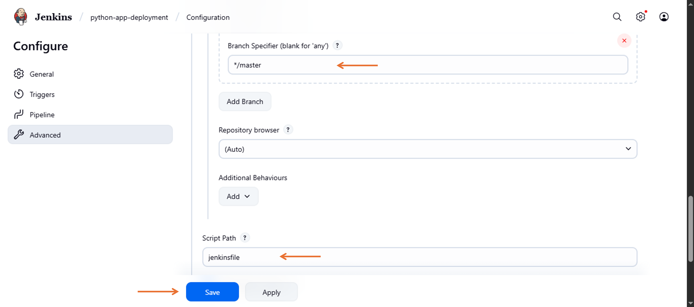

## Step → 9 : Build a Job

Click → Build Now

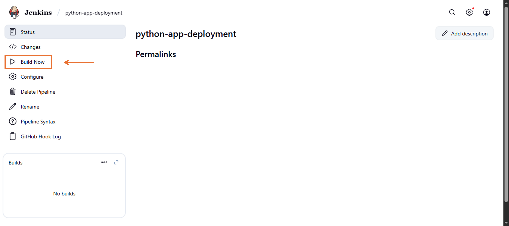

Check Console Output to monitor logs

If tests pass and the package is successful, your deployment step should execute

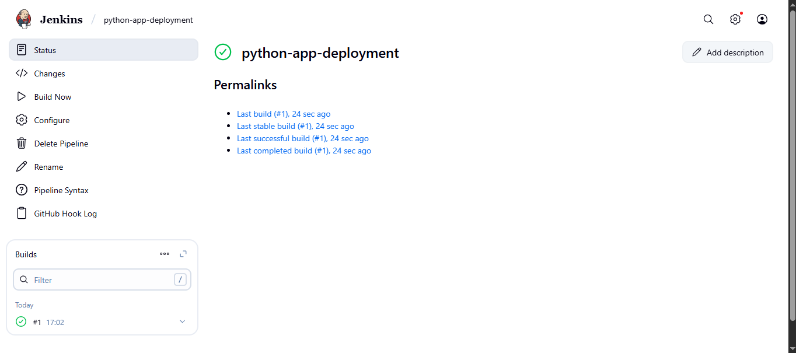

## Step → 10 : Add Github Webhook

- Github repo → Settings → Webhook → Payload URL → http://jenkins-server-public-IP:8080/github-webhook/ → Add Webhook

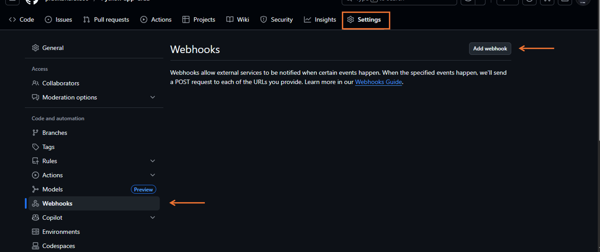

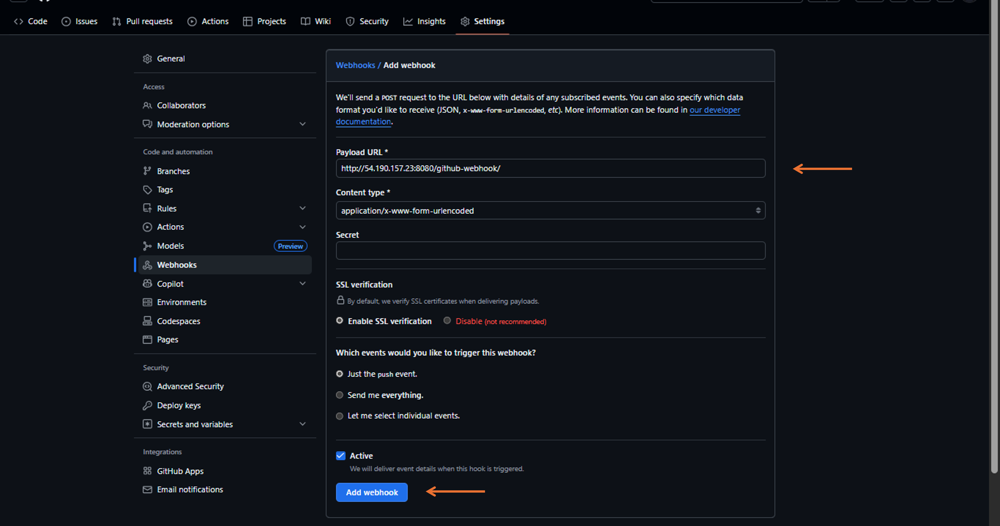

## Step → 11 : Enter the Public IP Address and port number in a web browser to view the deployed app

*Python application Deployed Successfully!!!*

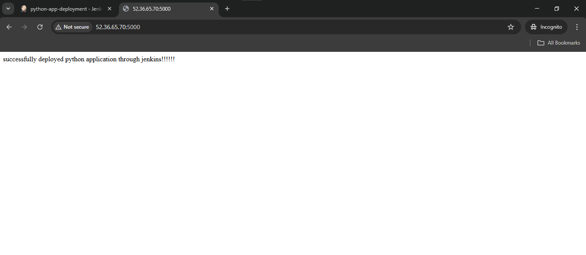

## Summary

Built an automated pipeline using Jenkins to build, test, and deploy a Python application. The pipeline pulls code from GitHub, installs dependencies, checks code quality, runs tests, and then deploys the app — all automatically. This helped speed up the development process, reduced errors, and made deployments easier and more reliable.
